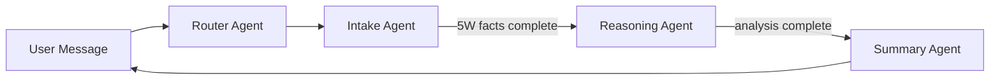

# Mistral Agents System

This module implements the multi-agent orchestration system using the Mistral AI Agents API.

## Architecture



### Agent Roles

| Agent | Purpose | Model |
|-------|---------|-------|
| **Router** | Silent routing to specialist agents | mistral-medium-2505 |
| **Intake** | Collect facts using 5W framework (Who, What, When, Where, Why) | mistral-medium-2505 |
| **Reasoning** | Legal analysis based on collected facts | mistral-medium-2505 |
| **Summary** | Generate user-friendly summary | mistral-medium-2505 |

## Key Files

| File | Purpose |
|------|---------|
| `__init__.py` | `MistralAgentsService` - main service class |
| `utils.py` | `AgentFactory`, shared prompts (`SUMII_CORE_DOS_DONTS`) |
| `router.py` | Router agent creation |
| `intake.py` | Intake agent creation + 5W tools |
| `reasoning.py` | Reasoning agent creation |
| `summary.py` | Summary agent creation |

## How Agents Are Created (Upsert Pattern)

**Critical**: We use an **upsert** pattern to prevent stale prompts.

```python
# From utils.py AgentFactory.create_agent()
existing_agents = self.client.beta.agents.list()
for agent in existing_agents:
    if agent.name == name:
        # UPDATE existing agent (preserves Agent ID)
        self.client.beta.agents.update(agent_id=agent.id, ...)
        return agent.id

# CREATE new agent only if not found
agent = self.client.beta.agents.create(...)
return agent.id
```

**Why this matters**:
- Mistral Conversations are bound to an **Agent ID**
- If we `create()` a new agent, existing conversations use the OLD agent with OLD instructions
- By `update()`-ing the existing agent, all conversations immediately use new instructions

## OCR Document Handling

When users upload files, the system:
1. Extracts text via OCR (`pixtral-large-latest`)
2. Injects OCR content into the user message:

```
IMPORTANT: The user has uploaded file(s)...

--- BEGIN EXTRACTED CONTENT FROM 'filename.jpg' ---
[OCR TEXT]
--- END EXTRACTED CONTENT ---

--- USER'S REQUEST ---
[User's actual message]
```

### Agent Prompt Instructions

All agents include `SUMII_CORE_DOS_DONTS` which contains:

```
<<<DOCUMENT ATTACHMENTS - CRITICAL>>>
If the message includes "EXTRACTED CONTENT" (OCR text):
1. ACKNOWLEDGE IT: "Ich sehe das Dokument..."
2. USE IT: Extract facts directly from this text
3. VERIFY IT: Ask user to confirm what you found

<<<PRIVACY & DATA HANDLING - CRITICAL>>>
You are a LEGAL ASSISTANT. Handling personal documents is your JOB.
- DO NOT REFUSE to analyze a document because it contains PII
- Treat all data confidentially, but YOU MUST PROCESS IT
```

## Mistral API Endpoints Used

| Endpoint | Purpose |
|----------|---------|
| `GET /v1/agents` | List existing agents (for upsert check) |
| `POST /v1/agents` | Create new agent |
| `PATCH /v1/agents/{id}` | Update existing agent |
| `POST /v1/conversations#stream` | Start new conversation |
| `POST /v1/conversations/{id}#stream` | Append to existing conversation |

## Lessons Learned

### 1. Agent Updates Require Upsert
**Problem**: Prompts updates weren't applying to existing conversations.
**Cause**: `create()` generated new Agent IDs; old conversations were stuck on old agents.
**Solution**: Implemented upsert pattern - find by name, update if exists.

### 2. PII Handling Requires Explicit Authorization
**Problem**: Agent refused to analyze driver's licenses ("I can't analyze personal info").
**Cause**: Default safety guardrails in LLM.
**Solution**: Added explicit "PRIVACY & DATA HANDLING" section to authorize PII processing.

### 3. Lazy Initialization Causes Flakiness
**Problem**: First request after deploy sometimes failed.
**Cause**: Agents initialized lazily on first WebSocket connection.
**Solution**: TODO - Initialize eagerly at app startup + add health check.

### 4. Conversations API Stores Server-Side History
**Insight**: Mistral's Conversations API maintains chat history server-side.
- `start_stream` creates new conversation
- `append_stream` adds to existing conversation
- History persists across sessions (linked by `conversation_id`)

## Configuration

### Environment Variables

```bash
MISTRAL_API_KEY=your-api-key
```

### Handoff Configuration

Handoffs are configured after all agents are created:

```python
# Router can hand off to all agents
client.beta.agents.update(
    agent_id=router_id,
    handoffs=[intake_id, reasoning_id, summary_id]
)

# Intake -> Reasoning -> Summary chain
client.beta.agents.update(agent_id=intake_id, handoffs=[reasoning_id])
client.beta.agents.update(agent_id=reasoning_id, handoffs=[summary_id])
```

## Debugging

### Check Agent Updates
Look for PATCH requests in Docker logs:
```
HTTP Request: PATCH https://api.mistral.ai/v1/agents/ag_xxx "HTTP/1.1 200 OK"
```

### Check Augmented Content
Look for OCR injection in logs:
```
[WebSocket] Sending augmented content to LLM (first 500 chars):
IMPORTANT: The user has uploaded file(s)...
```

### Verify Conversation ID
Each conversation has a Mistral conversation ID (`conv_xxx`):
```
HTTP Request: POST https://api.mistral.ai/v1/conversations/conv_xxx#stream
```
