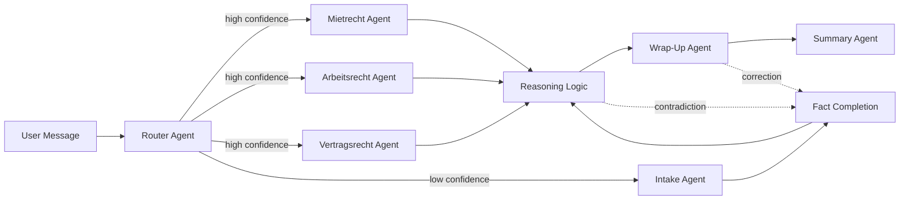

# Mistral Agents System

This module implements the 9-agent domain-aware orchestration system using the Mistral AI Conversations API.

## Architecture


```mermaid
flowchart LR
    User[User Message] --> Router[Router Agent]
    Router -->|high confidence| Miet[Mietrecht Agent]
    Router -->|high confidence| Arb[Arbeitsrecht Agent]
    Router -->|high confidence| Vert[Vertragsrecht Agent]
    Router -->|low confidence| Intake[Intake Agent]
    Miet --> Reasoning[Reasoning Logic]
    Arb --> Reasoning
    Vert --> Reasoning
    Intake --> FactComp[Fact Completion]
    FactComp --> Reasoning
    Reasoning --> WrapUp[Wrap-Up Agent]
    Reasoning -.->|contradiction| FactComp
    WrapUp --> Summary[Summary Agent]
    WrapUp -.->|correction| FactComp
```

### Agent Roles

| Agent | Purpose | Model |
|-------|---------|-------|
| **Router** | Classifies legal domain via `classify_legal_domain` tool, routes to domain agent or Intake fallback | mistral-medium-2505 |
| **Mietrecht Agent** | Domain-specific intake for tenancy law disputes/drafting | mistral-medium-2505 |
| **Arbeitsrecht Agent** | Domain-specific intake for employment law disputes/drafting | mistral-medium-2505 |
| **Vertragsrecht Agent** | Domain-specific intake for contract law disputes/drafting | mistral-medium-2505 |
| **Intake** | Generic fallback for low-confidence classifications | mistral-medium-2505 |
| **Fact Completion** | Additional fact gathering with 7-point framework | mistral-medium-2505 |
| **Reasoning Logic** | Contradiction detection and fact verification | mistral-medium-2505 |
| **Wrap-Up** | Completeness audit (14+ fields) + user confirmation | mistral-medium-2505 |
| **Summary** | Generate lawyer-ready legal summary + PDF | mistral-medium-2505 |

**CRITICAL**: All 9 agents pinned to `mistral-medium-2505`. Do NOT use `-latest` (resolves to 2508, broken handoffs). Do NOT use `magistral-*` models (ThinkChunks cause error 3051).

## Key Files

| File | Purpose |
|------|---------|
| `__init__.py` | `MistralAgentsService` — initialization, handoff config, version sync |
| `utils.py` | `AgentFactory` (hash-based upsert), `SUMII_CORE_DOS_DONTS`, `GERMAN_LANGUAGE_INSTRUCTIONS` |
| `router.py` | Router agent — domain classification |
| `intake.py` | Intake agent — generic 5W fact collection (fallback) |
| `fact_completion.py` | Fact Completion — 7-point framework, document upload prompting |
| `reasoning_logic.py` | Reasoning Logic — contradiction detection |
| `wrapup.py` | Wrap-Up — completeness audit, confirmation, declined fields |
| `summary.py` | Summary agent — markdown + PDF generation |
| `domains/domain_factory.py` | Template composition: base instructions + YAML configs |
| `domains/base_instructions.py` | `BASE_INTERVIEW_FRAMEWORK`, `LITIGATION_STAGE_OVERLAY`, `BASE_HANDOFF_INSTRUCTIONS` |
| `domains/configs/*.yaml` | Domain-specific interview questions (mietrecht, arbeitsrecht, vertragsrecht) |
| `tools/function_schemas.py` | `classify_legal_domain`, `extract_facts`, `generate_summary` schemas |
| `tools/completeness_check.py` | `check_completeness` — 14+ field audit with `declined_fields` |
| `tools/document_tracker.py` | `track_documents` — categorize uploaded/mentioned/requested docs |
| `tools/confirmation.py` | `signal_confirmation` — user yes/no + corrections |

## Domain-Aware Routing

Router classifies via `classify_legal_domain` function tool:
- **High confidence (>=0.7)** + `is_civil=true` → domain-specific agent
- **Low confidence (<0.7)** + `is_civil=true` → Intake fallback
- `is_civil=false` → polite redirect, no handoff

Classification stored on Conversation model (`legal_area`, `user_intent`, `classification` JSONB) — local-only, not sent back to Mistral.

## Domain Agents (Template Composition)

Domain agents are built via `create_domain_agent()` in `domain_factory.py`:

```
BASE_INTERVIEW_FRAMEWORK (shared)
  + domain YAML config (dispute + drafting questions)
  + BASE_HANDOFF_INSTRUCTIONS (shared)
  = complete agent instructions
```

Zero duplication. Adding a new domain = one new YAML file in `domains/configs/`.

## Version Sync

All 9 agents must be at the same version (mismatch → error 3000). `_sync_agent_versions()` auto-recovers by appending `<!-- v-sync:N -->` markers to lagging agents. N-bump optimization: only bumps the single highest version needed.

## Profile Data Injection

`build_user_profile_context()` (in `summary_validation.py`) prepends MANDANTENPROFIL to the first message:
- Known profile fields are listed
- Missing fields flagged as `FEHLENDE DATEN (bitte im Gespräch erfragen)`
- Agent instructions say to ask for these during the interview
- Profile is user-controlled — conversation data is NOT written back to profile

## Scripts

| Script | Purpose |
|--------|---------|
| `scripts/reset_mistral_agents.py --all` | Delete all agents and recreate on restart |
| `scripts/test_domain_agents.py` | Validate domain architecture against Mistral workspace |
| `scripts/diagnose_stream_stall.py` | Reproduce and test error 3000 recovery |
| `scripts/e2e_websocket_test.py` | Full E2E conversation through localhost WS |
